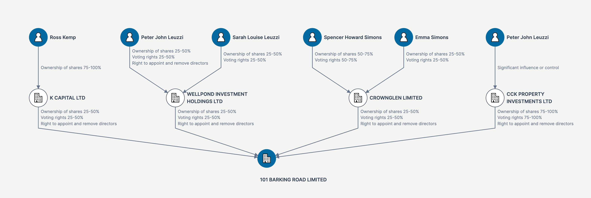
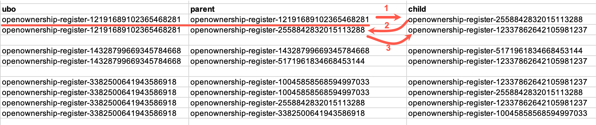
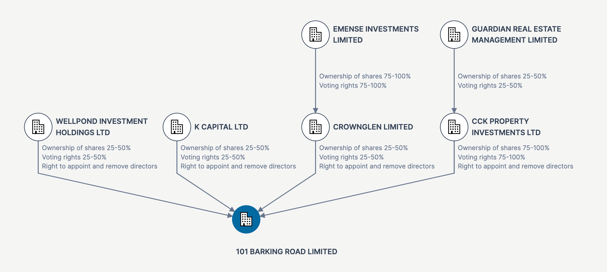
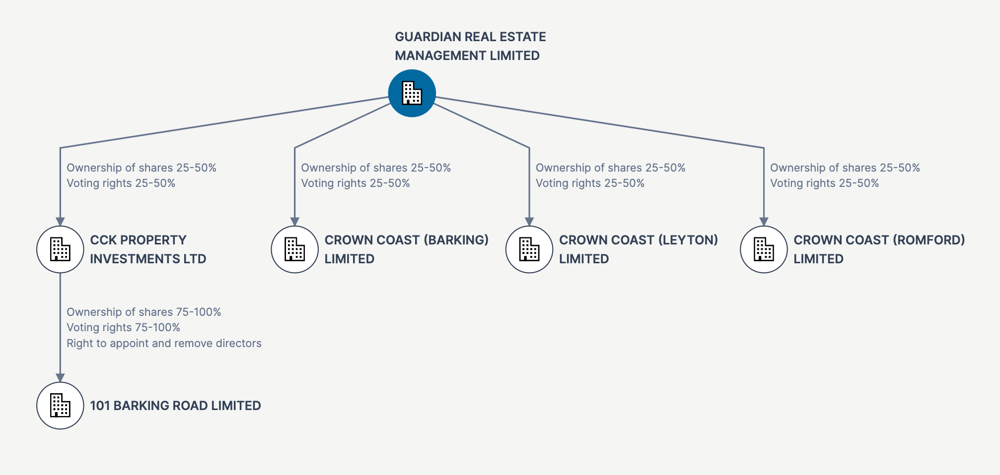

# Ownership & Control

[BODS RDF](https://github.com/cosmin-marginean/kbods/tree/main/kbods-rdf) enables a series of use cases
which rely on linking Open Ownership records with other datasets. At the same time, the graph nature of the
BODS model can be leveraged through RDF to enable several use cases specific to ownership and control.

We discuss here some of the opportunities enabled by an RDF (graph) representation of the BODS data, and the
way they've been implemented in this PoC. These don't require record linking logic with 3rd party datasets
and can be materialised using exclusively the Open Ownership register.

## UBOs
Generally, a UBO refers to an individual holding a certain interest (capital or voting rights) in a specific (target) entity.
The specifics vary depending on the jurisdiction, and sometime on the solution requirements, but it's usually considered that
for an individual to qualify as UBO, they must hold between 10% and 25% of the capital or voting shares. 

For the purposes of our PoC we have relaxed the definition to include any individuals holding any level of interest within
an entity. This is suitable for most cases, but in a real-world application there might a filtering logic based on the level
of equity will need to be considered. We deliberately left this out of the scope of this PoC.

[UBO Demo](https://drive.google.com/file/d/18lG9LSm6xAZzXAhBugPA1P-wIPR3ijsq/view?usp=drive_link)

### Graph traversal logic
In order to determine the UBOs for a given target (company), we must navigate the ownership chain upwards
(parent companies, parents of parents, etc) until we reach a record referring to an individual - the primary
criteria within the UBO definition.

It's often not sufficient to identify the individual, and we'll generally be interested in the ownership chain itself:
the list of relationships that build from a UBO down to our target.

The end goal is to produce a visual aid in the form of a reverse tree, which paints the complete picture of the way 
the UBOs exercise their control through intermediate companies. It's also essential to highlight the level of control
within each parent-child relationship (type of control, shares percentages, etc.



In the above example, we've identified a number of individuals with indirect control over our target,
101 BARKING ROAD LIMITED along with their level of control over intermediate entities.

With an RDF representation of the BODS dataset, we can implement a SPARQL query producing this
type of view.

```sparql
PREFIX rdf:   <http://www.w3.org/1999/02/22-rdf-syntax-ns#>
PREFIX bods:  <http://bods.openownership.org/vocabulary/>
PREFIX bodsr: <http://bods.openownership.org/resource/>
PREFIX onto:  <http://www.ontotext.com/>

SELECT ?ubo ?parent ?child ?controlStatement
FROM onto:disable-sameAs
WHERE {
    ?ubo bods:ownsOrControls* ?parent .
    ?ubo rdf:type bods:Person .
    
    ?controlStatement bods:hasInterestedParty ?parent .
    ?controlStatement bods:hasSubject ?child .
    
    ?child bods:ownsOrControls* bodsr:openownership-register-12337862642105981237 .
}
GROUP BY ?ubo ?parent ?child ?controlStatement
```

This query produces a list of parent-child relationships which includes the ID of the control statement (`?controlStatement`)
relevant to the relationships. The control statement ID is what's used to dereference the interest (level of control) between
the parent and the child.

Another essential element of each result in this set is the `?ubo` which will represent the individual at the "top" of the
ownership chain that the current relationship is part of. This is crucial for being able to group these relationships based
on the UBO that produced the relationships down to our target. 

Below is a CSV sample of the entities returned by this query and a representation of how the application logic to
group and traverse this structure.

_Note: We've removed the `http://bods.openownership.org/resource/` that's normally
returned by this SPARQL query to allow us to focus on the BODS statements._ 



Within each section of the result set, we always start with the row where the parent represents the UBO
(the ID of `parent` is the same as the ID of the `ubo`). The arrows 1, 2 and 3 represent the logical order in which these
relationship need to be displayed. This results in an ownership chain from the UBO in this section (`openownership-register-12191689102365468281`),
down to the target (`openownership-register-12337862642105981237`)

## Parent companies and ultimate parents
A concept similar to UBOs is the ultimate parent. This usually refers to the companies at the top of the ownership chain
for a target and there can be several entities that need to be identified for these purposes.

The logic to produce is very similar to UBOs: we're interested in entities "at the top", which have some direct or indirect
control over the target.

[Ultimate parents demo](https://drive.google.com/file/d/1FPGz1fsTUnfsUxtb9hhAqBpjXJJhjcsI/view?usp=drive_link)



The subtle difference here is how we qualify "the top". In the case of UBOs this is straightforward by
applying the filter `?ubo rdf:type bods:Person`. For (corporate) ultimate parents we will need a `?ultimateParent rdf:type bods:Entity`,
but this has the disadvantage of including any entity controlling our target, immaterial of whether itself is being controlled by another entity or not (i.e. whether it's "at the top" or not).

To achieve the correct version of this, we simply need to make sure that we only treat as "ultimate parent", an entity over which
no other entity has any direct control. The filter in the SPARQL query below implements just that.

```sparql
SELECT ?ultimateParent
WHERE  {
    ?ultimateParent bods:ownsOrControls* ?target .
    ?ultimateParent rdf:type bods:Entity .
    FILTER(STRSTARTS(STR(?ultimateParent), STR(bodsr:)))

    FILTER NOT EXISTS {
        ?s bods:ownsOrControls ?ultimateParent .
        ?s rdf:type bods:Entity .
    }
}
```

It's worth noting that the query above simply lists the ultimate parent companies, but not the ownership chains.
While it's possible to expand this query to include the ownership chains similarly to the UBO query, we chose to run a separate query
for each of the ultimate parents with a `?source` (ultimate parent) and `?destination` (our target) parameters. 

```sparql
PREFIX bods: <http://bods.openownership.org/vocabulary/>
PREFIX bodsr: <http://bods.openownership.org/resource/>

SELECT ?parent ?controlStatement ?child
WHERE {
    ?source bods:ownsOrControls* ?parent .
    ?controlStatement bods:hasInterestedParty ?parent .
    ?controlStatement bods:hasSubject ?child .
    ?child bods:ownsOrControls* ?destination .
    FILTER(STRSTARTS(STR(?parent), STR(bodsr:)))
    FILTER(STRSTARTS(STR(?child), STR(bodsr:)))
}
GROUP BY ?parent ?controlStatement ?child
```

This is an inefficient way of accomplishing a logic that's similar to UBO traversal since several database queries 
are required to produce the same result set. 

The first reason for this approach is that we wanted to showcase the elements that build the logic in these ownership
traversal algorithms.

The second was because we wanted to optimise for a "reverse tree" display of the ownership chains from the ultimate parent
to the target, which is much easier to reason about than a network (many-to-many) display.

Given the nature of corporate control relationships, it's not always possible to achieve the reverse tree view. For example,
it's very common for a company A to have an interest in both company B and C, while B has an interest in C:

```text
A -> B -> C
A -> C
```

A visual representation of this would then be
```text
   A----┐
   ↓    │  
   B    │
   ↓    │
   C ←--┘
```

While this is a finer level of detail, it doesn't necessarily fall into the list of needs for a use case where the ownership from A to
C is materialised by an intermediate B anyway.

Since with this particular use case we focused on identifying ultimate parents as the prime objective, a visual representation
that is easy to reason about took precedence.

It's important to note that this is a sub-optimal and opportunistic approach to solving a problem in a way that the solution
delivers a strong visual impact. Should your application require the "A to C" ownership details in the same
view, a logic similar to what we use for UBOs is what will be required (and a "reverse tree" view will not be suitable).


## Subsidiaries
Identifying subsidiaries for a target is a common use case in ownership & control scenarios, whether for diligence
purposes or investigative efforts.

The outcome here is symmetric to ultimate parents, but instead of traversing the ownership relationships upwards, we
navigate "downwards".

[Subsidiaries demo](https://drive.google.com/file/d/1hINxKzmPTui7MSXCzVpFfIgAS_TaHzqt/view?usp=drive_link)



This is in essence a tree view representing all the ownership chains "downwards" from a target, including all the entities
on these paths.

From a querying perspective, this is similar to the previous navigation examples, but it's somewhat simpler, as the starting
point is a single record (our target) which makes it easier to reason about the traversal logic.

```sparql
PREFIX rdf:   <http://www.w3.org/1999/02/22-rdf-syntax-ns#>
PREFIX bods:  <http://bods.openownership.org/vocabulary/>
PREFIX bodsr: <http://bods.openownership.org/resource/>
PREFIX onto:  <http://www.ontotext.com/>

SELECT ?parent ?child ?controlStatement
WHERE {
    ?target bods:ownsOrControls* ?parent .
    
    ?controlStatement bods:hasInterestedParty ?parent .
    ?controlStatement bods:hasSubject ?child .
}
GROUP BY ?parent ?child ?controlStatement
```

Here we're interested in parent-child relationships (and the relevant `?controlStatement`) which are on the path between
the target and any entity controlled by the target directly or indirectly (`bods:ownsOrControls*`).
