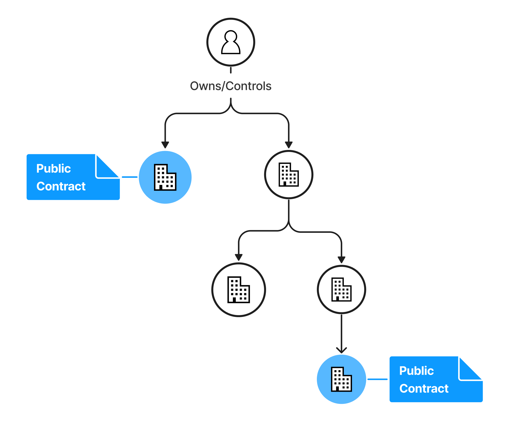
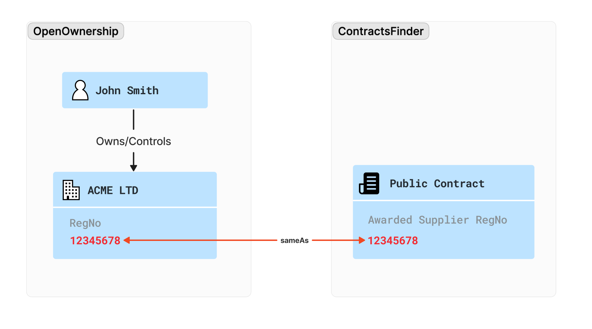

# UK Public Contracts


Given a target (individual or entity), we want to be able to identify any companies that they
control (directly or indirectly) which have been awarded public contracts. This can bring a higher order of visibility
and transparency over larger corporate groups in terms of their reliance on public procurement.

## Resources
* [Public contracts demo](https://drive.google.com/file/d/10VOnx_073Su4KwnDDIgRwIr0Lp4n05hz/view?usp=drive_link)
* [SPARQL Query to identify contracts for related entities](https://github.com/openownership/bodsriskdetection/blob/main/src/main/resources/sparql/public-contracts/contracts-for-related-entities.sparql)

## Record linking



This PoC uses public records from the [UK Public Contracts data](https://www.contractsfinder.service.gov.uk) cross-referenced
with the [Open Ownership Register](https://register.openownership.org/download), in order to identify UK registered companies
which have been awarded public contracts.

The first step is importing the relevant UK Contracts Finder data. The full contract data is imported in its document form (JSON)
in the Elasticsearch store, and the relevant links are persisted in the RDF database.

For the purposes of our PoC, we only require the only RDF statements we need are the ones linking 
a UK company (number) to the ID of the public contract that it's been awarded.

In the example below, we're stating that the UK company with registration number `03450311` has been awarded the public
contract with ID `10f99886-d048-40df-bf13-5db402330aef-188101`. Note that we're using [Companies House URIs](https://www.data.gov.uk/dataset/5a33338a-e142-4f05-9458-ca7283f410b3/company-identifiers-uris)
to refer to a UK company. More details on this data linking approach is discussed [in this article](https://world.hey.com/cos/using-bods-rdf-to-link-beneficial-ownership-records-with-other-datasets-0383cbd9).

```turtle
@prefix bodsrisk:        <http://bods.openownership.org/risk/> .
@prefix bodsrisk-entity: <http://bods.openownership.org/risk/entity/> .

<http://data.companieshouse.gov.uk/doc/company/03450311>
    bodsrisk:awardedPublicContract bodsrisk-entity:10f99886-d048-40df-bf13-5db402330aef-188101.
```

Linking a company in the Open Ownership Register then becomes a matter of creating an `owl:sameAs` between the BODS
record and the relevant Companies House URI. In order to produce this, we only need the company's registration number
which is available in the BODS record for a UK company.

```js
{
    "statementID": "openownership-register-15015183220188890661",
    ...
    "identifiers": [
        {
            "scheme": "GB-COH",
            "schemeName": "Companies House",
            "id": "03450311"
        },
    ...    
}
``` 

```turtle
@prefix owl:   <http://www.w3.org/2002/07/owl#> .
@prefix bodsr: <http://bods.openownership.org/resource/> .

bodsr:openownership-register-15015183220188890661
  owl:sameAs <http://data.companieshouse.gov.uk/doc/company/03450311> .
```

In this example, we're stating that our BODS record `openownership-register-15015183220188890661`
represents the UK company with registration number `03450311`.

This will then enable us to query the ownership chains while filtering for companies which have been awarded public contracts in the UK.
An example SPARQL query for this logic is available [here](https://github.com/openownership/bodsriskdetection/blob/main/src/main/resources/sparql/public-contracts/contracts-for-related-entities.sparql).

## A note on Contract Finder data
UK has made significant progress in making public procurement more transparent. However, there is still
a way to go in making the data easy to process and link by automated systems.

The major impediments are company identifiers, which are scarce and inconsistent. Only around 20% of the Contracts Finder
awards records include Companies House registration numbers (in the form GB-COH-00946107 where 00946107 is a company's registration
number in the UK).

This makes record linking a very complex problem which. In a real-world application relying on UK public procurement data,
one would have to devise algorithms based on company names and addresses, which themselves aren't always consistent.

It's important to note that this PoC is relying exclusively on the small subset of Contracts Finder records where
a Companies House number has been provided. This was sufficient to demonstrate the record linking capability for this use case,
but it's not practical for wider applications.

