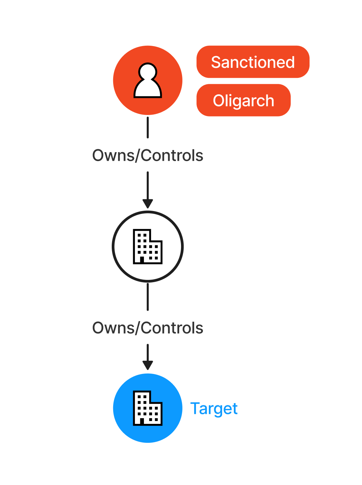
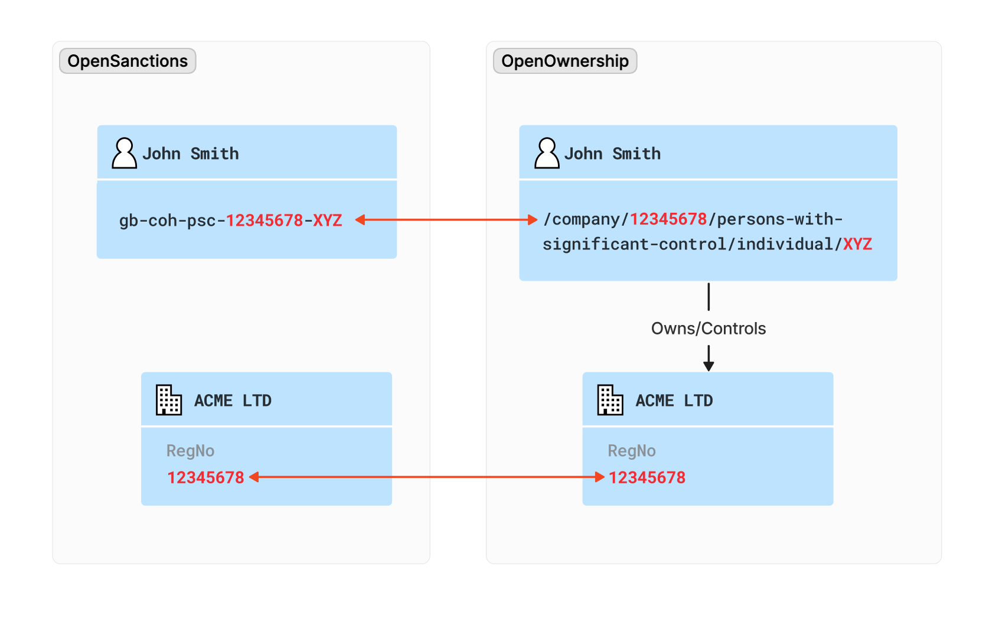

# Risk - PEP/Sanctions



A common use case in risk management is identifying whether a target is the subject to any sanctions, or if they are in
any way a politically exposed person (PEP).

By leveraging the inherent graph nature of the BODS ownership model, we are able to push this one step further and identify
what we called indirect risks: third parties connected to a target which are themselves politically exposed or sanctioned entities.

The process of attaching PEP/Sanctions data to BODS records relies on the [OpenSanctions](https://www.opensanctions.org/)
dataset, which is commonly used in a variety of Risk & Compliance use cases.

## Resources
* [PEP/Sanctions Demo](https://drive.google.com/file/d/1LRqfMuaQriMdqGA8T8jY3Ga6-iwDnHYw/view?usp=drive_link)
* Queries for identifying related entities with risks:
  * [Risks for child companies](https://github.com/openownership/bodsriskdetection/blob/main/src/main/resources/sparql/risk/find-risks-for-children.sparql) (subsidiaries or companies controlled by an individual)
  * [Risks for parent companies](https://github.com/openownership/bodsriskdetection/blob/main/src/main/resources/sparql/risk/find-risks-for-parents.sparql)
  * [Risks for the relatives of a UBO](https://github.com/openownership/bodsriskdetection/blob/main/src/main/resources/sparql/risk/find-risks-for-ubo-relatives.sparql)
  * [Risks for the associates of a UBO](https://github.com/openownership/bodsriskdetection/blob/main/src/main/resources/sparql/risk/find-risks-for-ubo-associates.sparql)

## Record linking
This part of the PoC relies on linking records from Open Ownership with the ones from [Open Sanctions](https://www.opensanctions.org/). 
This is in essence a matching and de-duplication exercise, which is a common problem that can be approached in different ways, depending
on the use case and data model constraints.

In order to contain the complexity of this PoC, we have deliberately avoided any approaches that go beyond what can be
inferred automatically from the dataset. In other words, we haven't explored probabilistic matching algorithms relying on
less-structured and less-reliable data points (name variations, dates of birth, addresses, etc). 

This has reduced the number of records we were able to link, but it has in turn provided stronger guarantees
for the ones we did, which seemed a reasonable compromise for a proof of concept.

The approach was then based on establishing the data points that act as identifiers or known references for an entity.

The first data point that we chose is a UK company's registration number, which is available both datasets.
This allows us to reliably "sameAs" an OpenSanctions record with one from the Open Ownership Register.

OpenSanctions also publishes PSC (persons of significant control) information for certain entities as additional 
references within a record. These can be matched against Companies House identifiers, which in turn can match the entity against a BODS record.



### Example
```js
{
    "statementID": "openownership-register-2746542985514644736",
    "identifiers": [
        {
            "schemeName": "GB Persons Of Significant Control Register",
            "id": "/company/06805907/persons-with-significant-control/individual/J-J1jG59ZOo_I7kOpyUNywDTiAw"
        }
        ...
    ],
    ...
}
```

Above is an Open Ownership record with its PSC reference. Below is the OpenSanctions entity record which includes in the
`referents` array an ID ("slug") `gb-coh-psc-06805907-j-j1jg59zoo-i7kopyunywdtiaw` which is the equivalent of the PSC URI
`/company/06805907/persons-with-significant-control/individual/J-J1jG59ZOo_I7kOpyUNywDTiAw`.

```js
{
    "id": "Q503147",
    "referents": [
        "gb-coh-psc-06805907-j-j1jg59zoo-i7kopyunywdtiaw",
        ...
    ],
    ...
}
```

They way we link these records is firstly by creating an `owl:sameAs` between the BODS record and the PSC "slug" when
we ingest the Open Ownership dataset.

```turtle
@prefix owl:   <http://www.w3.org/2002/07/owl#> .
@prefix bodsr: <http://bods.openownership.org/resource/> .

bodsr:openownership-register-2746542985514644736
  owl:sameAs  <https://w3id.org/ftm#gb-coh-psc-06805907-j-j1jg59zoo-i7kopyunywdtiaw> .
```

When importing the OpenSanctions dataset, we in turn explicitly create a triple between the PSC slug and the sanctioned
record
```turtle
@prefix owl: <http://www.w3.org/2002/07/owl#> .

<https://w3id.org/ftm#Q503147>
  owl:sameAs <https://w3id.org/ftm#gb-coh-psc-06805907-j-j1jg59zoo-i7kopyunywdtiaw> .
```

The RDF database will then materialise these separate statements as and `owl:sameAs` between `bodsr:openownership-register-2746542985514644736` (the Open Ownership record) 
and `<https://w3id.org/ftm#Q503147>` (the Open Sanctions record).
