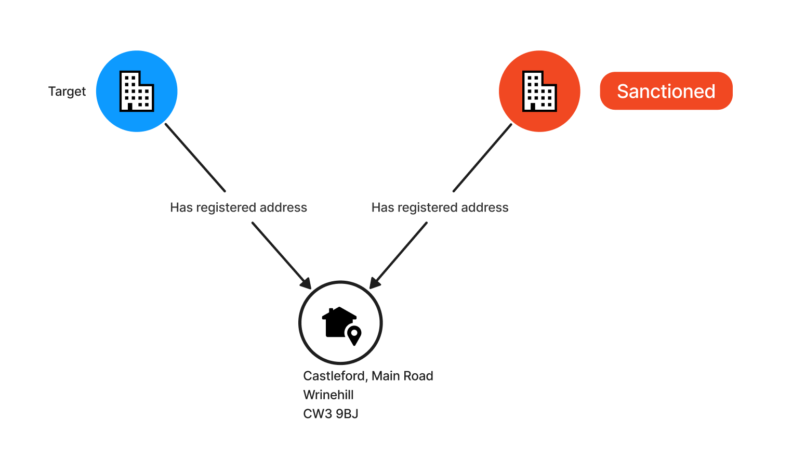
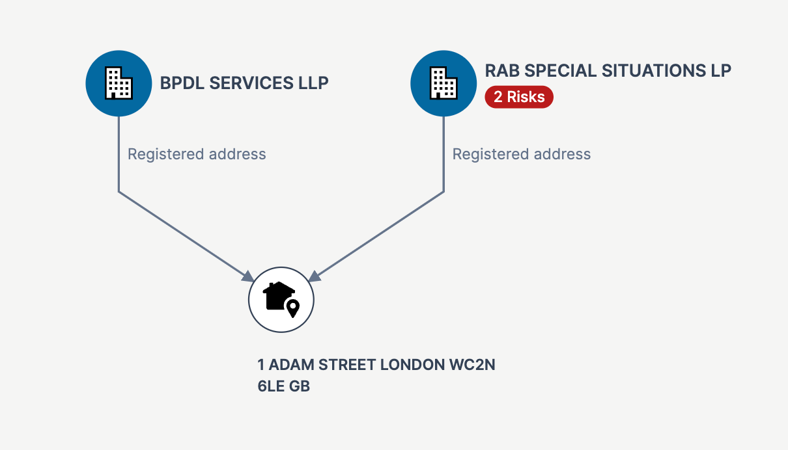

# Risk - Registered Address



The registered address for a legal entity can provide an insight into the network of companies related to a target.
There are several risk criteria that can be applied on this data point, including an address being used for a large number
of entities.

There are two areas which we focused on in this PoC in relation to registered addresses:
* Identifying sanctioned entities which share an address with a target (for which no direct risks are identified). This is using
  the [Open Sanctions](https://www.opensanctions.org/) dataset.
* Identifying entities listed in the [ICIJ Offshore Leaks database](https://offshoreleaks.icij.org/), which share an address with a target.

It's worth noting that exceptions (false positives) exist when we consider [company formation agents](https://www.gov.uk/government/publications/formation-and-company-secretarial-agents/company-formation-agents-and-secretarial-agents)
which can yield thousands of entities registered to the same address. For our purposes it wasn't feasible to address this
exception, and it must be considered as a special case to handle in a real-world application.

[Registered Address Risk Demo](https://drive.google.com/file/d/1FdeKT4ky5tGWdGxfc1qq28exNZTa4p6Y/view?usp=drive_link)
## Record linking

Matching addresses is a non-trivial problem with a variety of approaches having different degrees of complexity.
However, it wasn't practical to include any of these in our scope, and we devised a crude algorithm
which that can produce a small number of record matches which demonstrate the concept.

Our approach was to normalise the various fields within an address into an uppercase one-liner (string) for all entities
where a registered address was provided. This is then used as a lookup key against various sources to identify different
entities sharing an address.

### Example
Below is an Open Ownership record for a company and its registered address.
```js
{
    "statementID": "openownership-register-18078977022465671411",
    ...
    "addresses": [
        {
            "type": "registered",
            "address": "1 Adam Street, London, WC2N 6LE",
            "country": "GB"
        }
    ]
}
```

In the ICIJ Offshore Leaks database we have a CSV record for a (corporate) officers with the following details
reflecting the company's registered address.

nodes-officers.csv

| node_id | name | ... |
|-|-|-|
| 12014810 | RAB SPECIAL SITUATIONS LP | ... |

relationships.csv

| node_id_start | node_id_end | rel_type | ... |
|-|-|-|-| 
| 12014810 |14006986 | registered_address | ... |

nodes-addresses.csv

| node_id | address |..| country_codes | ... |
|-|-|-|-|-|
| 14006986 | 1 ADAM STREET LONDON WC2N 6LE| .. | GBR | ... |

For both these addresses we create a normalised version of the details, including the Alpha-2 country code to produce:
```turtle
"1 ADAM STREET LONDON WC2N 6LE GB"
```

This information is then attached as RDF triples to each of the entities. Note that we are creating a synthetic RDF address
entity to which we attach the string (literal) with the `bodsrisk:fullAddress` predicate.

**Open Ownership record**

```turtle
@prefix bodsr:           <http://bods.openownership.org/resource/> .
@prefix bodsrisk:        <http://bods.openownership.org/risk/> .
@prefix bodsrisk-entity: <http://bods.openownership.org/risk/entity/> .

bodsr:openownership-register-18078977022465671411
    bodsrisk:registeredAddress bodsrisk-entity:9869f628099c4b74bebe3ce4b088e04b .

bodsrisk-entity:9869f628099c4b74bebe3ce4b088e04b
    bodsrisk:fullAddress "1 ADAM STREET LONDON WC2N 6LE GB" .
```

**ICIJ Record**

```turtle
@prefix bodsrisk:        <http://bods.openownership.org/risk/> .
@prefix bodsrisk-entity: <http://bods.openownership.org/risk/entity/> .
@prefix icij:            <http://offshoreleaks.icij.org/entity/> .

icij:12014810
    bodsrisk:hasRisk           "icij", "panama-papers" ;
    bodsrisk:registeredAddress bodsrisk-entity:address-14006986 .

bodsrisk-entity:address-14006986
    bodsrisk:fullAddress "1 ADAM STREET LONDON WC2N 6LE GB" .
```
It's worth noting here that the `bodsrisk:hasRisk` predicate is used to indicate the risks attached against
an entity. In our PoC, the presence of a record in the ICIJ Offshore Leaks database is marked as `bodsrisk:hasRisk "icij"`.
We also mark the ICIJ investigation which originally listed the record, in this case `bodsrisk:hasRisk "panama-papers"`.

In order to identify entities with the same registration address as our Open Ownership target record
(`openownership-register-18078977022465671411`) we can now run the following SPARQL query.

```sparql
PREFIX bods: <http://bods.openownership.org/vocabulary/>
PREFIX bodsr: <http://bods.openownership.org/resource/>
PREFIX bodsrisk: <http://bods.openownership.org/risk/>

SELECT ?riskEntity (GROUP_CONCAT(DISTINCT ?risk;separator=",") as ?risks)
WHERE {
  bodsr:openownership-register-18078977022465671411
        bodsrisk:registeredAddress/bodsrisk:fullAddress ?fullAddress .
  ?riskEntity
        bodsrisk:registeredAddress/bodsrisk:fullAddress ?fullAddress .
  ?riskEntity bodsrisk:hasRisk ?risk .
}
GROUP BY ?riskEntity
```

This produces the result set below, reflecting the ICIJ record in our example, along with
what's been identified as risks for that entity.

|riskEntity|risks|
|-|-|
|http://offshoreleaks.icij.org/entity/12014810 | icij,panama-papers |

On the user interface, this translates to the following diagram.

